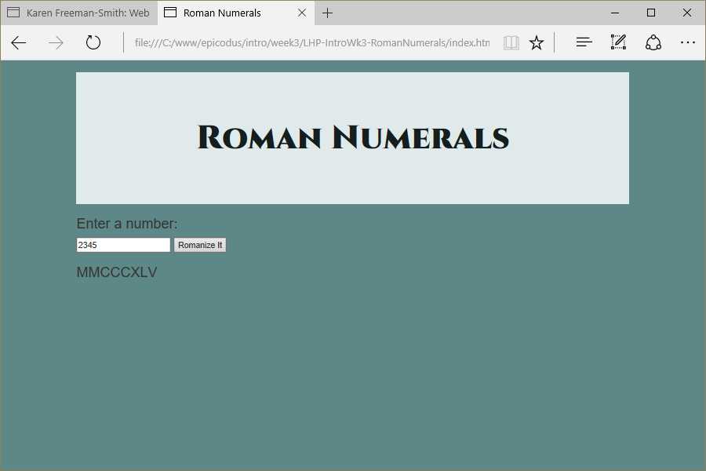

# Roman Numerals
Version 0.0.1: April 19, 2016
by [Karen Freeman-Smith](https://karenfreemansmith.github.io)

### Technologies Used
HTML, CSS, Bootstrap, JavaScript, jQuery

## Description
*[Learn How To Program](http://learnhowtoprogram.com) Intro to Programming Week 3 Individual Project: A website to convert decimal numbers to roman-numbers.*

## Setup/Installation
* [View on Github Pages](https://karenfreemansmith.github.io/LHP-IntroWk3-RomanNumerals)
* _OR_
* Clone directory
* Open index.html in your favorite browser

## Support & Contact
For questions, concerns, or suggestions please email karenfreemansmith@gmail.com

## Specifications
Program should have the following output:
* 5    | "V"
* 16   | "XVI"
* 22   | "XXII"
* 777  | "DCCLXXVII"
* 333  | "CCCXXXIII"
* 1888 | "MDCCCLXXXVIII"
* 2444 | "MMCDXLIV"
* 3999 | "MMMCMXCIX"
* 4000 | error message
* non-numeric input is rejected - error message/try again

## Known Issues
* None

## Legal
*Licensed under the GNU General Public License v3.0*

Copyright (c) 2016 Copyright _[Karen Freeman-Smith](https://karenfreemansmith.github.io)_ All Rights Reserved.
